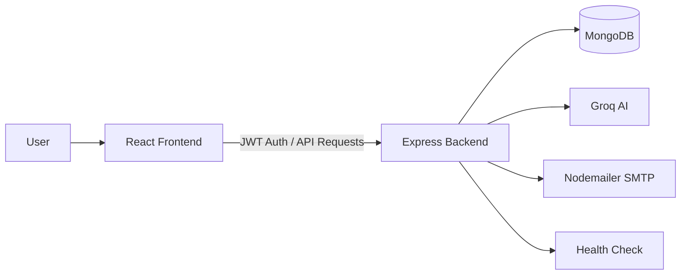

# Project Report

## Title Page

**Title:** MockMate AI: AI-Powered Mock Interview Platform

**Submitted By:** Rohit Patidar

**Roll No.:** IC-2K21-70

**Institute:** IIPS DAVV

**Program/Department:** MCA

**Academic Year:** [Academic Year]

**Guide/Faculty Mentor:** [Name, Designation]

**Date of Submission:** [Date]

---

## Declaration

I, Rohit Patidar (Roll No. IC-2K21-70), hereby declare that the project titled "MockMate AI: AI-Powered Mock Interview Platform" is my original work and has not been submitted elsewhere for any academic award. The report is prepared as part of the MCA curriculum at IIPS DAVV and all sources of information used in this report are duly acknowledged.

---

## Plagiarism Report

**Tool Used:** [Plagiarism Tool]

**Similarity Index:** [XX%]

**Date:** [Date]

---

## Acknowledgement

I express my sincere gratitude to my faculty guide [Name] for the guidance and support throughout this project. I also thank the department and IIPS DAVV for providing the resources and environment to complete this work. Lastly, I appreciate my peers and family for their encouragement and motivation.

---

## Table of Contents

1. Abstract
2. Executive Summary
3. Introduction
4. Problem Statement
5. Objectives
6. Scope of the Project
7. Feasibility Study
8. System Analysis
9. Technology Stack
10. System Architecture
11. Database Design
12. Functional Modules
13. API Design
14. Software Development Methodology
15. System Implementation
16. Testing and Validation
17. Output Screens and Reports
18. Limitations
19. Future Enhancements
20. Conclusion
21. Bibliography
22. Appendices

---

## Abstract

MockMate AI is an AI-powered mock interview platform designed to help students and early-career professionals practice interview skills in a realistic and structured environment. The platform simulates a live interview by asking one question at a time, adapting to the candidate's domain and experience level, and generating concise follow-up prompts that feel closer to a real technical interview than a static question bank. Users can participate through a chat-based interface, receive an evaluation at the end of the session, and review performance metrics from a personalized dashboard.

The system is built using a modern full-stack architecture. The frontend is implemented in React with Vite and Tailwind CSS, while the backend uses Node.js, Express, MongoDB, JWT authentication, and AI integration through Groq. The application also includes a coding practice module, a contact form with email delivery support, and protected user dashboards for progress tracking. The project focuses on usability, interview realism, session tracking, and actionable feedback.

---

## Executive Summary

MockMate AI is a complete interview preparation platform that combines AI-driven questioning, coding practice, user authentication, and analytics in one web application. It supports multiple interview domains such as Frontend, Backend, DBMS, and Core CS, and it adjusts questioning depth according to the selected experience level. During a session, the AI interviewer asks targeted questions, maintains conversation context, and keeps the interaction concise and professional.

The backend persists user data and interview history in MongoDB, while the frontend provides a polished dashboard to review scores, average performance, interview count, and practice time. The coding practice feature generates a fresh problem statement in JSON format and reviews submitted solutions using the AI model. A contact module allows users to send messages to the support team, with email delivery handled by Nodemailer when SMTP credentials are configured.

The result is a practical, scalable, and student-friendly platform that helps users practice interviews more frequently and more realistically. The design emphasizes clear navigation, authentication-based access control, reusable components, and AI-powered feedback.

---

## 1. Introduction

Interview preparation is often limited by the availability of mentors, scheduling constraints, and the cost of professional mock interview services. Many learners practice with static question lists, which do not capture the conversational nature of a real interview. MockMate AI was created to address that gap by offering an interactive, AI-based mock interview experience that can be accessed anytime.

The platform is built around the idea that interview practice should be dynamic, guided, and measurable. Instead of only providing answers, the system asks one question at a time, listens to the response, and continues the discussion through relevant follow-ups. At the end of the session, users receive a score and a structured evaluation so they can identify strengths and improvement areas.

---

## 2. Problem Statement

Students and job seekers often lack access to realistic interview practice that is both affordable and available on demand. Traditional preparation methods are usually passive and do not provide meaningful feedback on communication, conceptual understanding, or interview flow.

The problem addressed by this project is the absence of a personalized, interactive, and scalable mock interview environment that can:

- Simulate real interview interactions.
- Adapt questions to domain and experience level.
- Store user progress over time.
- Provide actionable feedback after each session.

---

## 3. Objectives

The main objectives of the project are:

- To build an AI-driven mock interview platform with domain-specific questioning.
- To support multiple experience levels such as fresher, junior, mid-level, and senior.
- To provide a coding practice area with AI-generated problems and AI-based solution review.
- To implement secure user authentication and protected application routes.
- To store interview history and performance metrics for future review.
- To provide a responsive and modern user interface suitable for desktop and mobile use.

---

## 4. Scope of the Project

The project covers the following functional areas:

- User sign-up, login, and session-based access control.
- Home, About, Contact, Dashboard, Interview, and Code Practice pages.
- AI-driven interview chat with conversation memory per session.
- Final evaluation of interview performance.
- Coding problem generation and code review.
- Interview history, average score, and performance statistics.
- Contact form submission and email notifications.

The project does not attempt to replace human interviewers entirely. Instead, it serves as a practice and preparation tool that helps users build confidence before real interviews.

---

## 5. Feasibility Study

### Technical Feasibility

The project is technically feasible using widely adopted technologies such as React, Express, MongoDB, JWT, and AI APIs. The architecture supports modular development and can be extended in the future.

### Operational Feasibility

The application is easy to use for students and professionals because it offers familiar web-based navigation, simple authentication flows, and clear interview progression.

### Economic Feasibility

The system uses standard open-source technologies and can be hosted affordably. The AI and email integrations depend on external services, but the project remains cost-effective for academic and small-scale use.

### Schedule Feasibility

The scope is realistic for a student project because the system is divided into manageable components: frontend UI, backend APIs, AI integration, data storage, and testing.

---

## 6. System Analysis

### Functional Requirements

- Users must be able to create an account and log in securely.
- Users must be able to start an AI interview by selecting a domain and difficulty.
- The system must retain interview context during the session.
- The system must generate a final interview score and feedback.
- Users must be able to generate and submit coding practice answers.
- The dashboard must show statistics and recent interview history.

### Non-Functional Requirements

- The application should be responsive and visually consistent.
- Authentication should be protected using JWT.
- Passwords should be hashed before storage.
- API routes should validate input and return meaningful errors.
- The system should remain maintainable and modular.

---

## 7. Technology Stack

### Frontend

- React 19
- Vite
- React Router
- Tailwind CSS
- Axios
- Lucide React icons
- Monaco Editor for code practice
- Web Speech APIs for voice-based interaction

### Backend

- Node.js
- Express 5
- MongoDB and Mongoose
- JWT for authentication
- bcryptjs for password hashing
- Groq SDK for AI responses and evaluations
- Nodemailer for contact form emails
- CORS and dotenv for runtime configuration

### Development Tools

- ESLint
- PostCSS
- Vite build tooling

---

## 8. System Architecture

The system follows a client-server architecture with AI and database services integrated on the backend.

### Architecture Explanation

- The frontend handles routing, authentication-aware UI, and all user interactions.
- The backend exposes REST endpoints for auth, interview sessions, practice problems, evaluations, and contact requests.
- MongoDB stores user accounts and interview records.
- Groq provides AI-generated interview responses, final evaluations, and coding problem reviews.
- Nodemailer sends contact form emails when SMTP credentials are available.

### Data Flow

1. A user signs up or logs in.
2. The frontend stores the token and requests protected data.
3. The user starts an interview or practice session.
4. The backend sends prompts to the AI model and returns responses.
5. The session ends with an evaluation and saved score.
6. The dashboard reflects the updated performance data.

---

## 9. Database Design

### User Collection

The user schema stores account details and performance history.

| Field | Type | Purpose |
| --- | --- | --- |
| name | String | User display name |
| email | String | Unique login email |
| password | String | Hashed password |
| interviews | Array | Interview history |
| totalInterviews | Number | Total completed interviews |
| averageScore | Number | Running average of scores |
| timestamps | Boolean | Created and updated dates |

### Interview Collection

The interview schema stores detailed session data.

| Field | Type | Purpose |
| --- | --- | --- |
| userId | ObjectId | Reference to the user |
| sessionId | String | Unique session identifier |
| domain | String | Interview domain |
| difficulty | String | Chosen level |
| duration | String | Session duration |
| finalScore | Number | Overall score |
| transcript | Array | Question and answer history |
| evaluation | Mixed | AI-generated evaluation object |
| metrics | Object | Session-level word and timing metrics |

### Design Notes

- Passwords are hashed using bcrypt before storage.
- Interview records are indexed by user and session for uniqueness.
- The user dashboard relies on interview summaries for historical reporting.

---

## 10. Functional Modules

### 10.1 Authentication Module

This module handles sign-up, login, token generation, and protected profile access. It validates email format, checks password length, compares hashed passwords, and returns a JWT token for authenticated access.

### 10.2 Interview Module

This module powers the AI mock interview flow. It keeps per-session conversation history in memory, builds domain-specific system prompts, and asks the AI model to continue the interview one question at a time.

### 10.3 Evaluation Module

After the interview ends, the system sends the transcript to the AI model for scoring and structured feedback. The returned JSON includes overall score, strengths, weaknesses, and detailed per-question feedback.

### 10.4 Practice Module

This module generates coding problems and evaluates submitted code. It returns a standardized JSON problem statement and reviews the candidate solution using the AI model.

### 10.5 Dashboard Module

The dashboard presents key user metrics such as total interviews, average score, minutes practiced, best score, and the latest session summary.

### 10.6 Contact Module

The contact page submits support messages. If email credentials are configured, the backend sends both a support email and a confirmation email to the user. If SMTP is not configured, the message is logged and the user still receives a success response.

---

## 11. API Design

### Authentication APIs

- `POST /api/auth/signup` - Register a new user.
- `POST /api/auth/login` - Authenticate and issue a token.
- `GET /api/auth/me` - Return the current user ID from the token.
- `GET /api/auth/profile/:id` - Fetch a user's profile.

### Interview APIs

- `POST /api/interview` - Send a user response and receive the next AI interviewer reply.
- `POST /api/interview/evaluate` - Evaluate the complete interview transcript.
- `POST /api/interview/complete` - Save interview results to the user's history.
- `POST /api/interview/end` - Clear session memory on completion.

### Practice APIs

- `POST /api/practice/problem` - Generate a new coding problem.
- `POST /api/practice/submit` - Review a submitted coding solution.

### Contact and Utility APIs

- `POST /api/contact` - Submit the contact form.
- `GET /api/health` - Check server health.

### API Behavior Summary

- Input validation is enforced on required fields.
- Token-based authorization is used for protected actions.
- AI responses are normalized to JSON where needed.
- Interview sessions are stored in memory and cleared when the session ends.

---

## 12. Software Development Methodology

An incremental and iterative development approach was used for this project. The work was divided into logical phases:

1. Requirement analysis and feature planning.
2. UI layout and route structure in the frontend.
3. Authentication and database integration.
4. Interview AI prompt design and session handling.
5. Coding practice module and AI review logic.
6. Dashboard statistics and result persistence.
7. Testing, bug fixing, and UI refinement.

This approach made it easier to validate each subsystem before moving to the next one and reduced integration risk.

---

## 13. System Implementation

### Frontend Implementation

The frontend uses React Router to manage navigation across public and protected pages. The app includes a shared authentication provider, guarded routes for dashboard and practice features, and reusable UI components such as the navigation bar, footer, and protected route wrapper.

The user interface is designed to feel like a modern product rather than a basic academic demo. It uses a dark visual theme, gradient accents, card-based sections, and responsive layouts. The interview page supports conversational interaction, while the practice page provides an editor-driven coding environment.

### Backend Implementation

The backend is implemented with Express and organized into route handlers for authentication and contact support, while the main server file contains the interview, practice, evaluation, health, and completion endpoints. MongoDB is used to persist user records and interview history.

### AI Implementation

Groq is used as the AI inference layer for both interview conversation and evaluation. The system prompts are carefully written to keep the interview realistic, concise, and focused on follow-up questioning rather than tutoring. For coding practice, the model is instructed to generate strict JSON so the frontend can render the problem in a structured format.

### Security Implementation

- Passwords are hashed with bcrypt.
- JWT tokens are signed with a server secret.
- Protected routes require authentication.
- Server configuration is moved to environment variables.
- Basic request validation is applied before processing.

---

## 14. Testing and Validation

### Testing Strategy

The project was validated through manual and functional testing across major flows.

### Test Cases

| Test Case | Expected Result | Status |
| --- | --- | --- |
| User registration with valid data | Account created and token returned | Pass |
| Login with valid credentials | User authenticated successfully | Pass |
| Login with invalid credentials | Request rejected | Pass |
| Start AI interview | Interview session begins | Pass |
| Continue interview conversation | AI responds with next question | Pass |
| Complete interview and evaluate | Score and feedback generated | Pass |
| Save interview completion | User history updated | Pass |
| Generate coding problem | Structured problem returned | Pass |
| Submit code for review | AI review returned | Pass |
| Contact form submission | Message accepted and email flow handled | Pass |

### Validation Notes

- The interview flow was checked for response continuity and history management.
- The practice feature was checked for JSON parsing and review output.
- Dashboard metrics were verified against saved interview records.
- Error handling was confirmed for missing input and unauthorized access.

---

## 15. Output Screens and Reports

The application provides the following major user-facing outputs:

- Home page with project overview and call-to-action.
- Login and sign-up screens for authentication.
- Dashboard with progress metrics and recent session summary.
- Interview screen with live AI conversation.
- Coding practice screen with generated problem statements and editor submission.
- Contact screen for support requests.
- Final interview evaluation with score and feedback.

These outputs support both practice and progress tracking, which are the primary goals of the platform.

---

## 16. Limitations

The current system has the following limitations:

- Interview and practice sessions are stored in memory on the server, so they are cleared when the server restarts.
- AI quality depends on the availability and behavior of the external model service.
- Voice features depend on browser support and may vary across devices.
- Contact email delivery requires valid SMTP credentials.
- The AI evaluation is useful for practice but should not be treated as a perfect substitute for human judgment.

---

## 17. Future Enhancements

The platform can be extended in several useful ways:

- Persist interview and practice sessions in the database instead of memory.
- Add richer analytics such as topic-wise score trends and response time charts.
- Introduce multiple interview templates for company-specific practice.
- Add resume upload and resume-based question generation.
- Support timed practice modes with better scoring breakdowns.
- Store detailed feedback history for long-term progress tracking.
- Add admin reporting for support requests and platform usage.

---

## 18. Conclusion

MockMate AI successfully delivers a practical and polished mock interview experience for students and early-career professionals. It combines authentication, AI-driven interviews, structured evaluations, coding practice, and progress dashboards into a single platform. The architecture is modular, the user experience is modern, and the AI workflow is tailored to simulate a real interview conversation.

The project demonstrates how modern web technologies can be used to build an interactive learning tool with strong real-world value. With additional persistence, analytics, and refinement, MockMate AI can evolve into a more advanced interview preparation platform for broader academic and professional use.

---

## 19. Bibliography

- https://react.dev/
- https://vitejs.dev/
- https://tailwindcss.com/
- https://expressjs.com/
- https://www.mongodb.com/
- https://mongoosejs.com/
- https://www.npmjs.com/package/groq-sdk
- https://nodemailer.com/

---

## 20. Appendices

### Appendix A: Environment Variables

- `MONGODB_URI`
- `JWT_SECRET`
- `GROQ_API_KEY`
- `GROQ_MODEL`
- `EMAIL_HOST`
- `EMAIL_PORT`
- `EMAIL_SECURE`
- `EMAIL_USER`
- `EMAIL_PASSWORD`
- `SUPPORT_EMAIL`
- `PORT`

### Appendix B: Main Collections

- User
- Interview

### Appendix C: Main API Endpoints

- `POST /api/auth/signup`
- `POST /api/auth/login`
- `GET /api/auth/me`
- `GET /api/auth/profile/:id`
- `POST /api/interview`
- `POST /api/interview/evaluate`
- `POST /api/interview/complete`
- `POST /api/interview/end`
- `POST /api/practice/problem`
- `POST /api/practice/submit`
- `POST /api/contact`
- `GET /api/health`

### Appendix D: Project Summary

- Frontend: React, Vite, Tailwind CSS
- Backend: Node.js, Express, MongoDB
- Authentication: JWT + bcrypt
- AI: Groq-powered interview and review workflows
- Communication: REST APIs and SMTP-based contact handling
